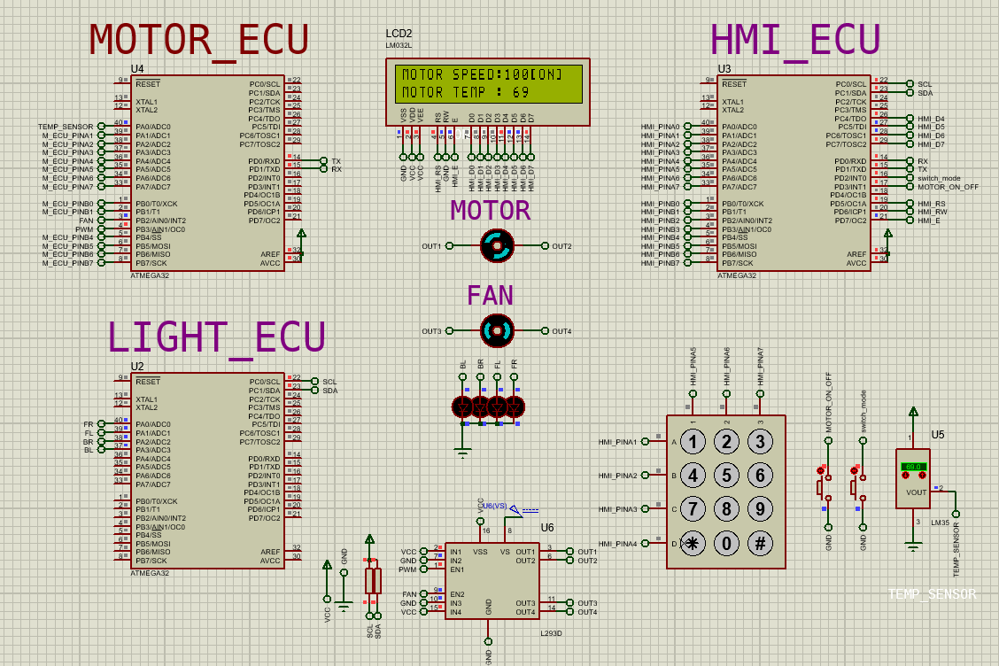
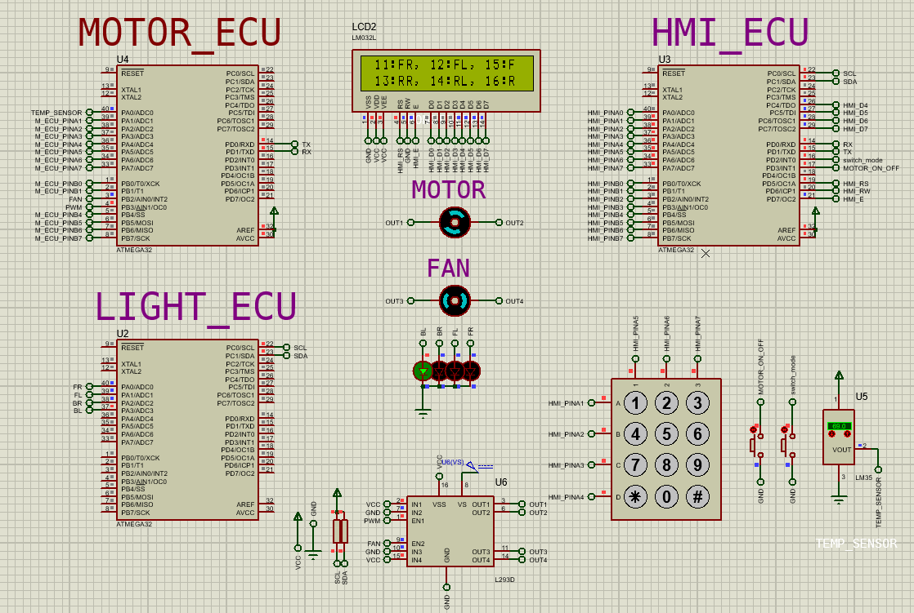

# This is a system consisting of three ATmega32
HMI_ECU  : to monitor the system and send commands to other ECUs\
MOTOR_ECU: to drive the motor and the van using motor driver L293D\
LIGHT_ECU: to control the car light system

# connections between ECUs
HMI<--->UART<--->MOTOR_ECU\
HMI<--->i2c<---->LIGHT_ECU

# Used pirferals
Timer1\
Timer0\
ADC\
External enterrupts

# Code
Code is written using PlatformIO. You can find the HEX files in the "pio" folder in each ECU folder.

# motor_unit_control

# light_unit_control
